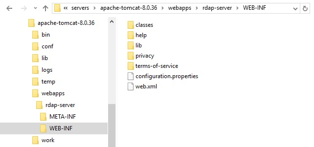

# Configuring Red Dog server behavior

This document explains how to tweak a Red Dog server's behavior.

1.	Find the **WEB-INF/configuration.properties** file in your installation directory. It should look like this:

	

	It contains the following lines

        #Optional.Language of the server. Values en=english, es=español. Default:en
        language=
        #Required.Zones managed (separated by commas). example: mx, lat, com
        zones=
        #Optional.Minimum length of the search pattern. Default 5
        minimum.search.pattern.length=
        #Optional.Max number of results for the authenticated user. Default 20
        max.number.result.authenticated.user=
        #Optional.Max number of results for the unauthenticated user. Default 10
        max.number.result.unauthenticated.user=
        #Optional. Indicates the roles that are the owners of the rdap objects. example: registrar, administrative, registrant. Default: empty
        ownerRoles =
        #Optional. Indicates whether this rdap server should respond to reverse IPv4 domain searchs. Default false
        is_reverse_ipv4_enabled =
        #Optional. Indicates whether this rdap server should respond to reverse IPv6 domain searchs. Default false
        is_reverse_ipv6_enabled =
        #Allowed Values: registry, registrar, None. Default: none
        operational_profile=
        #Optional. Boolean value to indicate if the nameserver is used as a Domain Attribute. Default value = false (Is used as object)
        nameserver_as_domain_attribute=
        #Optional. anonymous, username. Default 'anonymous'.
        anonymous_username = 

2.	Adjust the variables however you see fit. Each one is preceded by a small description of it.

3.	Run the server and make a request to test the configuration.

Other relevant notes:

* The **WEB-INF** folder is the default location of the **configuration.properties** file, but you can define a new location by following these steps:

    1.	In **WEB-INF/web.xml**, find the following lines:
 
			```
			<!-- <context-param> -->
				<!-- <param-name> -->
					 rdapConfigurationUserPath
				<!-- </param-name> -->
				<!-- <param-value> -->
				<!-- </param-value> -->
			<!-- </context-param> -->
			```

    2.	Uncomment them, and write a valid directory path in `param-value`.
    3.	Save the changes and test the configuration.

# Where to go next

Now that we have finished the basic configuration to start the server, we can continue with the optional configuration, we recommend to continue with the option to grant access to the server resources to a select group of users, this information can be searched in this [document](response-privacy.html "Response Privacy Configuration").

