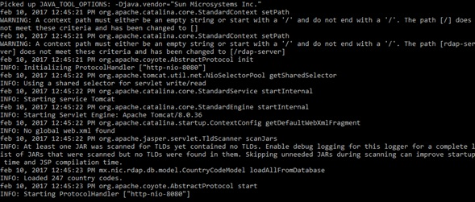
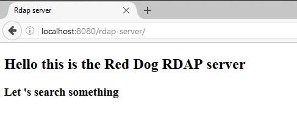

# RDAP Demo Server

## Index

1. [Introduction](#introduction)
2. [Download](#download)
3. [Running the demo](#running-the-demo)
4. [Available features](#available-features)
5. [Available configuration](#available-configuration)
6. [Dummy data](#dummy-data)
	1. [Domain data](#domain-data)
	2. [Entity data](#entity-data)
	3. [Nameserver data](#nameserver-data)

## Introduction

Before you begin a full installation of Red Dog, you can try its features out using our demo server. It is a standalone Tomcat binary packaged with Red Dog and an embedded (H2-based) database populated with dummy data.

The only requirement is Java 8 or superior.

## Download

You can download the demo server from this [page](demo-download.html).

## Running the demo

Expand the compressed zip and run the jar normally:

	unzip rdap-server-demo-1.0.zip
	cd rdap-server-demo
	java -jar demo.jar

The server will run at [http://localhost:8080/rdap-server/](http://localhost:8080/rdap-server/) by default. You can change the binding IP and port, using the `java -jar demo.jar [your-IP-address [your-port]]` syntax. As an example:

	java -jar demo.jar 127.0.0.5 9090

When the server starts, the console will log messages as shown below. As long as you don't get SEVEREs (as opposed to INFOs), the server is underway.

 
The demo server is now ready to answer requests. In your browser, query the address that you set up and you should see a welcome page:
 

 
## Available features

As a demo version, this server has limited features compared to the ones defined in RFC 7482 (excluding ASN and IPs queries), as well as the ones from the full server. Here are examples of queries that should be successful. See the [tables below](#dummy-data) for more options.

+ Domain query`*`: [`domain/goldfish.com`](http://localhost:8080/rdap-server/domain/goldfish.com)
+ Entity query: [`entity/mr_fish`](http://localhost:8080/rdap-server/entity/mr_fish)
+ Nameserver query: [`nameserver/ns2.chopsuey.net`](http://localhost:8080/rdap-server/nameserver/ns2.chopsuey.net)
+ Domains search: [`domains?name=p*`](http://localhost:8080/rdap-server/domains?name=p*)
+ Entities search: [`entities?handle=mr*`](http://localhost:8080/rdap-server/entities?handle=mr*)
+ Nameservers search: [`nameservers?name=ns1*`](http://localhost:8080/rdap-server/nameservers?name=ns1*)

`*` Because of the shipped configuration of `zones` (see below), only .com and .com.example domains will yield success.

## Available configuration

`WEB-INF/configuration.properties` is Red Dog's global configuration file. Since the server is running, you might play around with some fields if you want. You can find documentation [here](behavior-configuration.html).

Notice that tweaks to this file require a server restart to go live.

## Dummy data 

The demo's database ships with the following test data:

### Domain data

| Handle   | ldh (letter, digit, hyphen) name | Unicode name     | Zone         |
|:---------|:-------------------------------- |:-----------------|:-------------|
| DOM1     | whiterabbit                      |                  | com          |
| DOMCOM   | goldfish                         |                  | com          |
| XXX2     | reddog                           |                  | com          |
| 1234     | blackcat                         |                  | com          |
| ylb      | yellowbird                       |                  | com          |
| DOM2     | conejo_blanco                    |                  | com.example  |
| DOMCOMMX | pez_dorado                       |                  | com.example  |
| XXX3     | perro_rojo                       |                  | com.example  |
| 1235     | gato_negro                       |                  | com.example  |
| pjra     | pajaro_amarillo                  |                  | com.example  |
| DOM3     | conejo_blanco                    |                  | example      |
| DOMMX    | pez_dorado                       |                  | example      |
| XXX4     | perro_rojo                       |                  | example      |
| 1236     | gato_negro                       |                  | example      |
|          | pajaro_amarillo                  |                  | example      |
| DOM4     | choco                            |                  | test         |
| DOMLAT   | moka                             |                  | test         |
| XXX6     | 1.0.168.192                      |                  | in-addr.arpa |
| 1238     | xn--mxico-bsa                    | méxico           | test         |
| xnxn     | xn--elpjaroamarillo-pjb          | elpájaroamarillo | test         |

### Entity data

| Handle     | Full Name |
|:-----------|:----------|
| mr_rabbit  | Bill      |
| mr_fish    | Billy     |
| mr_dog     | Bob       |
| mr_cat     | Barry     |
| mr_bird    | Wonka     |
| don_conejo | Tristan   |
| don_pez    | Shane     |
| don_perro  | Layne     |
| don_gato   | Brittney  |
| don_pajaro | Blair     |
| sr_conejo  | Gary      |
| sr_pez     | Gepetto   |
| sr_perro   | Cindy     |
| sr_gato    | Roy       |
| sr_pajaro  |           |
| cone       |           |
| pez        |           |
| perr       |           |
| gat        |           |
| paj        |           |

### Nameserver data

| Handle | ldh(letter, digit, hyphen) name | Unicode name           | IP Address      |
|:-------|:--------------------------------|:-----------------------|:----------------|
| NSE1   | ns1.chopsuey.net                |                        | 192.168.1.1     |
| NSE2   | ns2.chopsuey.net                |                        | 192.168.1.2     |
| NSE3   | ns3.chopsuey.net                |                        | 192.168.1.3     |
| NSE4   | ns4.chopsuey.net                |                        | 1:0:0:0:0:0:0:1 |
| NSE5   | ns5.chopsuey.net                |                        | 2:0:0:0:0:0:0:2 |
| NSE6   | ns1.white.example               |                        | 192.168.1.4     |
| NSE7   | ns2.white.example               |                        | 192.168.1.5     |
| NSE8   | ns3.white.example               |                        | 192.168.1.6     |
| NSE9   | ns4.white.example               |                        | 192.168.1.7     |
| NSE10  | ns5.white.example               |                        | 192.168.1.8     |
| NSE11  | ns1.bright.info                 |                        |                 |
| NSE12  | ns2.bright.info                 |                        |                 |
| NSE13  | ns3.bright.info                 |                        |                 |
| NSE14  | ns4.bright.info                 |                        |                 |
| NSE15  | ns5.bright.info                 |                        |                 |
| NSE16  | ns1.camión.test                 | ns1.xn--camin-3ta.test |                 | 
| NSE17  | ns2.camión.test                 | ns2.xn--camin-3ta.test |                 |
| NSE18  | ns3.camión.test                 | ns3.xn--camin-3ta.test |                 |
| NSE19  | ns4.camión.test                 | ns4.xn--camin-3ta.test |                 |
| NSE20  | ns5.camión.test                 | ns5.xn--camin-3ta.test |                 |

