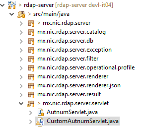
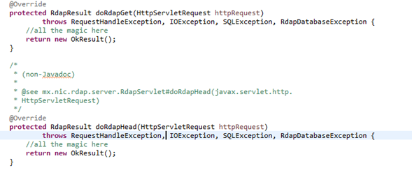
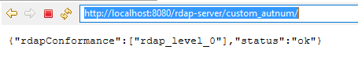
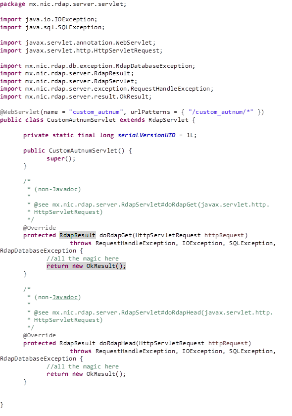

#  Rdap Extensibility

As defined in RFC 7480 section 6, our server supports the implementation of extensions for the RDAP protocol, so if you want to provide your own custom segment paths, for example, if we want to add a **custom_autnum** extension, we have to do the following:

1.	Find the **mx.nic.rdap.server** package

	

2.	Add a new Servlet, in our example, let's add **CustomAutnumServlet** and extend **RdapServlet** class.

	

3.	Override the **doRdapGet** and **doRdapHead** methods with the processing that you want.

	

4.	Add the tags **@WebServlet(name,urlPatterns)**. The **name** tag specify your servlet name, **urlPatterns** is used to define which is the servlet path.

	

5.	Run the server and go to your servlet path to test it.

	

And that's it. We have just added a basic extension to our RDAP server, if you want to know more about RDAP extensibility, checkout RFC 7480 section 6 and 7482 section 5.

The full code example is the following:

