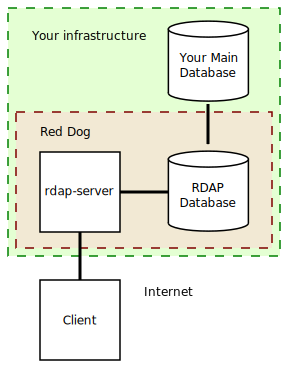
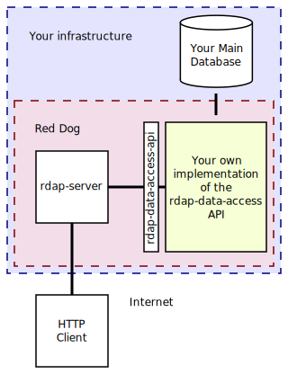

# Introduction to RDAP/Red Dog

## Index

1. [What is RDAP?](#what-is-rdap)
2. [What is Red Dog?](#what-is-red-dog)
3. [Architecture](#architecture)
	1. [Basic Form](#basic-form)
	2. [Advanced Form](#advanced-form)
4. [Status](#status)

## What is RDAP?

RDAP (_Registration Data Access Protocol_) is a successor of WHOIS--a protocol used for querying information regarding Internet resources (such as domain names, IP addresses and autonomous system numbers).

Some advantages of RDAP over WHOIS are

- Standardized request and response formats, in contrast to WHOIS' provider-defined arbitrary text.
- Reliance on Representational State Transfer (REST) technologies, a strong base which is widely known.
- Bootstrapping, the automatic determination of where a query should be sent.
- Support for Internationalized Domain Names and support for localized registration data.
- Support for identification, authentication and access control to the service.

## What is Red Dog?

Red Dog is a free and open source Java implementation of an RDAP server currently under development.

## Architecture

RDAP is based on a typical client-server model. The server is a RESTful service providing HTTP content in accordance with RFCs [7480](https://tools.ietf.org/html/rfc7480), [7481](https://tools.ietf.org/html/rfc7481), [7482](https://tools.ietf.org/html/rfc7482) and [7483](https://tools.ietf.org/html/rfc7483).

Ideally, Red Dog's database is a separate entity that caches the relevant information from your main database, mainly so DOS attack attempts to your RDAP Server will not disturb your core systems.

> Note: boxes named in low caps are the Red Dog subprojects you can find [here](https://github.com/NICMx).

You can deploy this in two separate ways:

### Basic Form

Red Dog's basic database is a predefined relational schema:

If you want to deploy this form, you have to provide the following configuration:

1. [Deploy `rdap-server`](server-install.html), a typical Java web application in your favorite servlet container.
2. [Prepare the `RDAP Database`](database-schema.html). Only MySQL has been tested so far.
3. [Configure `rdap-migrator`](migrator.html), which involves providing export queries that will periodically copy the relevant information from `Your Main Database` to the `RDAP Database` so `rdap-server` can query it.
4. (Optional) Fine-tune `rdap-server`:
	1. [Server behavior](behavior-configuration.html)
	2. [Server response privacy](response-privacy.html)
	3. [Help Response](help-response.html)
	4. [User authentication](user-authentication.html)
	5. [Optional Authentication](optional-authentication.html)
	6. [Rate Limit](rate-limit.html)

### Advanced Form

You will have access to this form if you have coding horsepower.

By implementing the [`rdap-db`](https://github.com/NICMx/rdap-db) API, you can wrap `Your Main Database` to `rdap-server` in any way you want, which can range as anything from direct queries to `Your Main Database` to queries to non-relational databases.

If you want to deploy this form, you have to provide the following configuration:

1. [Deploy `rdap-server`](server-install.html), a typical Java web application in your favorite servlet container.
2. [Implement the `rdap-db` API](TODO).
3. [Instruct the `rdap-server` to use your implementation](TODO).
4. (Optional) Fine-tune `rdap-server`:
	1. [Server behavior](behavior-configuration.html)
	2. [Server response privacy](response-privacy.html)
	3. [Help Response](help-response.html)
	4. [User authentication](user-authentication.html)
	5. [Optional Authentication](optional-authentication.html)
	6. [Rate Limit](rate-limit.html)

## Status

There are three development phases planned as of 2016-09-20:

1. Lookup Path Segment, rate-limit, basic authentication, JSON render, help command.
2. Search Path Segment, Digest authentication, rate-limit penalization, Apache Proxy support, access configuration, indexing.
3. Federated Authentication, HTML render, redirection, extensions, internationalization, query cache, client, API, installer.

<del>Phase 1 is currently under development.</del> TODO

