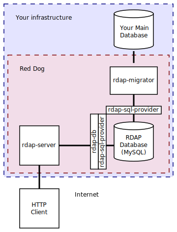
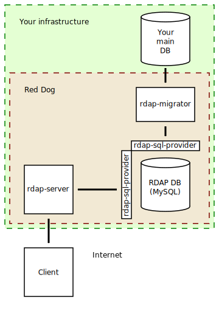

# Introduction to RDAP/Red Dog

## What is RDAP?

RDAP (_Registration Data Access Protocol_) is a successor of WHOIS--a protocol used for querying information regarding Internet resources (such as domain names, IP addresses and autonomous system numbers).

Some advantages of RDAP over WHOIS are

- Standardized request and response formats, in contrast to WHOIS' provider-defined arbitrary text.
- Reliance on Representational State Transfer (REST) technologies, a strong base which is widely known.
- Bootstrapping, the automatic determination of where a query should be sent.
- Support for Internationalized Domain Names and support for localized registration data.
- Support for identification, authentication and access control to the service.

## What is Red Dog?

Red Dog is a free and open source Java implementation of an RDAP server currently under development.

## Architecture

RDAP is based on a typical client-server model. The server is a RESTful service providing HTTP content according to RFCs [7480](https://tools.ietf.org/html/rfc7480) through [7483](https://tools.ietf.org/html/rfc7483).

The database is a separated entity from your business's main database, mainly so DOS attack attempts to your RDAP Server will not interfere on your core systems. In this inaugural implementation, RedDog's database is a predefined relational schema, which means an export mechanism is called for:

So, in order to run an RDAP Server using RedDog, you need to [deploy a webserver](server-install.html) and also [provide export routines]() that will periodically extract the relevant information from your core database.

## Status

There are three development phases planned as of 2016-09-20:

1. Lookup Path Segment, rate-limit, basic authentication, JSON render, help command.
2. Search Path Segment, Digest authentication, rate-limit penalization, Apache Proxy support, access configuration, indexing.
3. Federated Authentication, HTML render, redirection, extensions, internationalization, query cache, client, API, installer.

<del>Phase 1 is currently under development.</del> TODO

