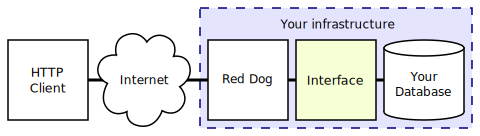
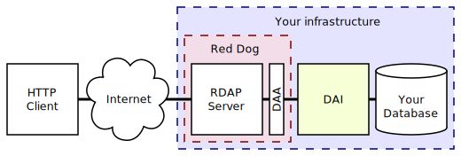
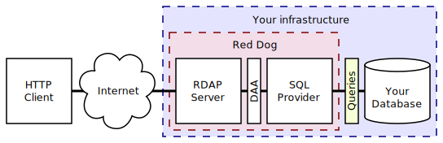
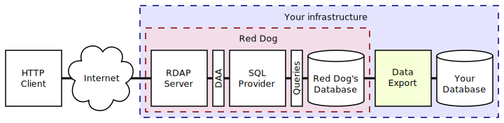

# Introduction to RDAP/Red Dog

## Index

1. [What is RDAP?](#what-is-rdap)
1. [What is Red Dog?](#what-is-red-dog)	
   1. [Option 1: Development of a DAI](#option-1-development-of-a-dai)
   1. [Option 2: Overriding SQL Provider queries](#option-2-overriding-sql-provider-queries)
   1. [Option 3: Using Red Dog's builtin schema](#option-3-using-red-dogs-builtin-schema)

## What is RDAP?

RDAP (_Registration Data Access Protocol_) is a successor of WHOIS--a protocol used for querying information regarding Internet resources (such as domain names, IP addresses and autonomous system numbers). RDAP is based on a typical client-server model. The server is a RESTful service expected to provide HTTP content in accordance with RFCs [7480](https://tools.ietf.org/html/rfc7480), [7481](https://tools.ietf.org/html/rfc7481), [7482](https://tools.ietf.org/html/rfc7482) and [7483](https://tools.ietf.org/html/rfc7483).

Some advantages of RDAP over WHOIS are

- Standardized request and response formats, in contrast to WHOIS' provider-defined arbitrary text.
- Reliance on [Representational State Transfer (REST)](http://www.ics.uci.edu/~fielding/pubs/dissertation/rest_arch_style.htm) technologies, a strong base which is widely known.
- Bootstrapping, the automatic determination of where a query should be sent.
- Support for Internationalized Domain Names and support for localized registration data.
- Support for identification, authentication and access control to the service.

## What is Red Dog?

Red Dog is a free and open source Java implementation of an RDAP server carcass. It is a handful of servlets and APIs that can help you serve your registration data in a standard manner.

As pictured, deploying Red Dog requires the development of an interface between your database and the servlets. This can be done in three different ways:

### Option 1: Development of a DAI

The [Data Access API](https://github.com/NICMx/rdap-data-access-api) (DAA) project is a module of Red Dog which mainly consists of [a set of Java interfaces](https://github.com/NICMx/rdap-data-access-api/tree/master/src/main/java/mx/nic/rdap/db/spi). The server queries a "Data Access Implementation" (DAI) --an implementation of these interfaces-- to access the data.

By rolling out your own DAI you can wrap your database to the server in any way you want. This can range from anything from direct queries to `Your Main Database`, or to a mirror of it, to queries to non-relational databases.

The page [Data Access Layer](data-access-layer.html) has some directions that might help you get started in creating a DAI.

### Option 2: Overriding SQL Provider queries

The [SQL Provider](https://github.com/NICMx/rdap-sql-provider) project is a functional reference DAI that is intended to perform queries to a relational database. Instead of developing a full Java project, you provide queries that return data in a predefined format and structure.

The page [Overriding Red Dog Queries](overriding-queries.html) helps to find the specifications that these queries need to fulfill.

>  Please identify and be aware of the maintenance overhead of using this option if future bugs or RFC updates require modifications to the query specification.

### Option 3: Using Red Dog's builtin schema

The [SQL Provider](https://github.com/NICMx/rdap-sql-provider) project ships with default queries, intended to be used along a predefined database schema.

What you need to provide under this architecture is a means to export your data from your core database to Red Dog's database.

The page [Exporting a database to Red Dog's built-in schema](migration.html) will help to understand the predefined schema.

>  Please identify and be aware of the maintenance overhead of using this option if future bugs or RFC updates require modifications to Red Dog's schema.
