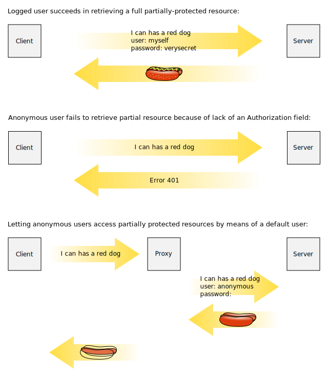

<a href="documentation.html">Documentation</a> > <a href="documentation.html#miscellaneous">Miscellaneous</a> > Optional Authentication

# Optional Authentication

## TEST H2 1

Typically, stock HTTP authentication operates in an all-or-nothing model:

1. Client requests resource anonymously.
2. Server answers "[`401 - Unauthorized`](https://en.wikipedia.org/wiki/List_of_HTTP_status_codes#4xx_Client_Error)".
3. Client repeats the request, including credentials in a header field named "[*Authorization*](https://en.wikipedia.org/wiki/List_of_HTTP_header_fields#Request_fields)".
4. Server validates credentials and returns the resource on success.

(Technically, users can provide credentials prematurely if they foresee the 401 and want to skip the first and second steps, but the above is more practical.)

As a result, protected objects are *completely* concealed until clients have identified themselves. Even if the servlet knows that some information should be made public, HTTP bans any access lacking _Authorization_. If you want to support "optional" authentication (allowing partial objects to be accesed by anonymous users), you often need to work around the model.

## TEST H2 2

One way to do it is by providing "default" authentication to anonymous users. In other words, you register a dummy, "anonymous" user in your servlet container, and you append a corresponding *Auhorization* header to every request lacking one before it reaches the server. The servlet then takes care of returning only "public" information to this user, and reveal other information normally to others.

One way to append this forked header to requests is by means of reverse proxies. If you intend to load balance traffic to the RDAP server through Apache servers, for example, you can reuse them for this purpose. Assuming your "anonymous" user has an empty password, the following Apache configuration will command a proxy to append a valid Authorization header to every incoming request lacking one (assuming you're using [Basic Authentication](https://tools.ietf.org/html/rfc2617#section-2)):

	LoadModule headers_module /path/to/mod_headers.so
	RequestHeader setifempty Authorization "Basic YW5vbnltb3VzOg=="

("`YW5vbnltb3VzOg==`" is the Base64 representation of "`anonymous:`". See the [`headers`](http://httpd.apache.org/docs/current/mod/mod_headers.html) module and its [RequestHeader](http://httpd.apache.org/docs/current/mod/mod_headers.html#RequestHeader) statement.)

