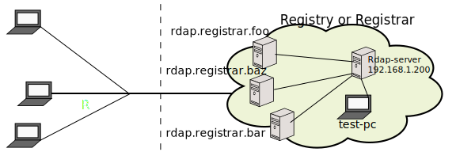

# {{ page.title }}

Starting from RedDog server v1.4.3, you can replace dynamically a value in links according what the user requested.

If needed, you have to add the value of `{host}` in "href" and "value" properties in links.

This feature are available to the next configurations:
1. [Configuring RedDog's Help Response](help-response.html)
1. [Configuring RedDog's Terms of Service](terms-of-service.html)
1. [Configuring RedDog's response Notices](notices.html)
1. [Configuring RedDog's response Events](events.html)

Example

```xml
<tos>
   <notice>
      <title>Help Page</title>
      <description>
         <line>Here are a replaceable link to help</line>
      </description>
      <links>
         <link href="{host}/rdap-server/help">Link to help: {host}/rdap-server/help</link>
      </links>
   </notice>
   <notice>
      <title>Domain Requests</title>
      <description>
         <line>Link to Domain Requests</line>
      </description>
      <links>
         <link href="{host}/rdap-server/domain">Link to domain: {host}/rdap-server/domain</link>
      </links>
   </notice>
</tos>
```

 For example, according to the diagram:



If you put 3 reverse proxies in front of your rdap-server with HTTPS and an user makes a request to `https://rdap.registrar.foo/rdap-server/domain/test.foo`

the response will be

```
{
	"rdapConformance" : ["rdap_level_0"],
     "notices" :
     [
       {
         "title" : "Help Page",
         "description" :
         [
           "Here are a replaceable link to help"
         ],
         "links" :
         [
           {
             "value" : "Link to help: https://rdap.registrar.foo/rdap-server/help",
             "href" : "https://rdap.registrar.foo/rdap-server/help"
           }
         ]
       },
       {
         "title" : "Domain Requests",
         "description" :
         [
           "Link to Domain Requests"
         ],
         "links" :
         [
           {
             "value" : "Link to domain: https://rdap.registrar.foo/rdap-server/domain",
             "href" : "https://rdap.registrar.foo/rdap-server/domain"
           }
         ]
       }
     ],
		"lang" : "en",
		"objectClassName" : "domain",
     ...
		... Blah blah Rdap Response
		...
}
```

If another user makes a request to `https://rdap.registrar.bar/rdap-server/domain/test.bar`

The response will be like
```
{
	"rdapConformance" : ["rdap_level_0"],
     "notices" :
     [
       {
         "title" : "Help Page",
         "description" :
         [
           "Here are a replaceable link to help"
         ],
         "links" :
         [
           {
             "value" : "Link to help: https://rdap.registrar.bar/rdap-server/help",
             "href" : "https://rdap.registrar.bar/rdap-server/help"
           }
         ]
       },
       {
         "title" : "Domain Requests",
         "description" :
         [
           "Link to Domain Requests"
         ],
         "links" :
         [
           {
             "value" : "Link to domain: https://rdap.registrar.bar/rdap-server/domain",
             "href" : "https://rdap.registrar.bar/rdap-server/domain"
           }
         ]
       }
     ],
		"lang" : "en",
		"objectClassName" : "domain",
     ...
		... Blah blah Rdap Response
		...
}
```

If an internal test is performed (`http://192.168.1.200/rdap-server/domain/test.foo`)

Response will be like

```
{
	"rdapConformance" : ["rdap_level_0"],
     "notices" :
     [
       {
         "title" : "Help Page",
         "description" :
         [
           "Here are a replaceable link to help"
         ],
         "links" :
         [
           {
             "value" : "Link to help: http://192.168.1.200/rdap-server/help",
             "href" : "http://192.168.1.200/rdap-server/help"
           }
         ]
       },
       {
         "title" : "Domain Requests",
         "description" :
         [
           "Link to Domain Requests"
         ],
         "links" :
         [
           {
             "value" : "Link to domain: http://192.168.1.200/rdap-server/domain",
             "href" : "http://192.168.1.200/rdap-server/domain"
           }
         ]
       }
     ],
		"lang" : "en",
		"objectClassName" : "domain",
     ...
		... Blah blah Rdap Response
		...
}
```


