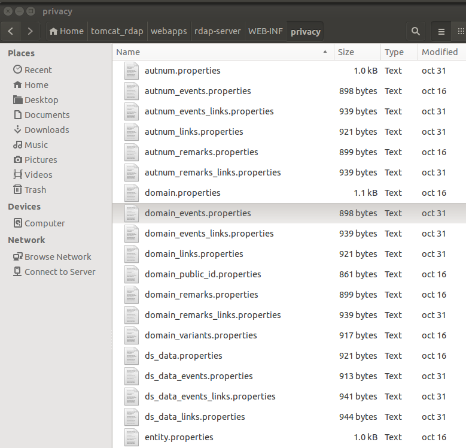

# Configuring _Red Dog_ server response privacy

As required by the RFC 7481, our server give you the  option for you to decide which data should be presented to your server users.
Depending if is an anonym user, an authenticated user or the data owner(You define which entity role should be taken as the information owner in the [configuration](behavior-configuration.html "Server Behavior Configuration") file)
This document tells you how to set up the Red Dog server response privacy,you can configure each property of every rdap object.

1.	Find the **WEB-INF/privacy** folder in your installation directory. It should look like this:
	
	

	It contains a “_properties_” file for each object used in the server response and has a similar structure. In example, here is the content of the **domain.properties** file: 

		#For each attribute you can use the values: owner, authenticate, any or none.
		#The owner value specify that only the owner of the object can see the attribute.
		#The authenticate value specify that any authenticate user can see the attribute.
		#The any value specify that the attribute can be seen by authenticated and unauthenticated users.
		#The none value specify that the attribute cannot be seen by any user
		handle = any
		ldhName = any
		unicodeName = any
		variants = any
		nameservers = any
		secureDNS = any
		entities = any
		status = any
		publicIds = any
		remarks = any
		links = any
		port43 = any
		events = any
		network = any
    	
2. Configure the object attributes privacy, as each file header said, you can assign one of the following values:

	+	The **owner** value specify that only the owner  of the object can see the attribute.
	+	The **authenticate** value specify that any authenticate user can see the attribute.
	+	The **any** value specify that the attribute can be seen by authenticated and unauthenticated users.
	+	The **none** value specifiy that the attribute cannot be seen by any user.

3. Run the server and make a search request to test the configuration.

Other relevant notes:

+	**WEB-INF** folder is the default location for the privacy configuration, but you can configure the folder where the server will read the privacy properties:

	1.   In the **WEB-INF/web.xml**, find the following lines:

				<!-- <context-param> -->
					<!-- <param-name> -->
						privacySettingsUserPath
					<!-- </param-name> -->
					<!-- <param-value> -->
					<!-- </param-value> -->
				<!-- </context-param> -->

	2.	Uncomment them, and write a valid directory path in the `“param-value”`.

	3.	Save the changes and test the configuration.

+	 The default value of privacy is commented in each file. 

+	 Each object has its file for privacy configuration.

+	 Check [RFC 7483](https://tools.ietf.org/html/rfc7483 "JSON Responses for the Registration Data Access Protocol (RDAP)") for a list of each object and attribute that form a RDAP response.

# Where to go next

Now that your RDAP server is ready, let's configure the[help command](help-response.html "Help Command Configuration").

