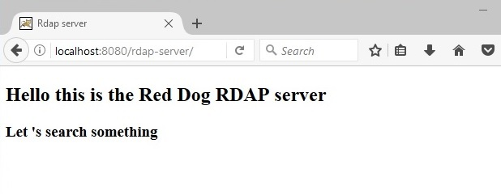

# Server Installation

The server is your typical servlet Java WAR using a MySQL database; simply toss it into your favorite servlet container. The following is an improvised example on how you might do this in Ubuntu/Tomcat; if you favor other means or environments, knock yourself out.

## Tomcat

Install Java:

	sudo apt-get install openjdk-8-jre

Install and start MySQL:

	sudo apt-get install mysql-server

[Prepare the database schema](database-schema.html).

Install Tomcat:

	# I'm not using the Ubuntu repositories because their Tomcat is rather old.
	# You will probably need to adapt this link because it keeps changing.
	# See www-us.apache.org/dist/tomcat/tomcat-8
	wget www-us.apache.org/dist/tomcat/tomcat-8/v8.5.12/bin/apache-tomcat-8.5.12.tar.gz
	tar -xzvf apache-tomcat-8.5.12.tar.gz
	CATALINA_HOME=$(pwd)/apache-tomcat-8.5.12
	JRE_HOME=/usr/lib/jvm/java-8-oracle/jre

Install the MySQL driver on Tomcat:

	cd $CATALINA_HOME/lib
	# https://dev.mysql.com/downloads/connector/j/
	wget https://dev.mysql.com/get/Downloads/Connector-J/mysql-connector-java-5.1.40.zip
	unzip -j mysql-connector-java-5.1.40.zip mysql-connector-java-5.1.40/mysql-connector-java-5.1.40-bin.jar

Create the data source that will link Red Dog and the database by adding the following tag to `<GlobalNamingResources>` in `$CATALINA_HOME/conf/server.xml`:

	<Resource name="jdbc/rdap"
	    type="javax.sql.DataSource"
	    auth="Container"
	    driverClassName="[mydb_driver_class_name]"
	    url="[mydb_url]"
	    username="[mydb_user]"
	    password="[mydb_pass]"
	    validationQuery="select 1 from dual" />

Install Red Dog on Tomcat:

	cd $CATALINA_HOME/webapps
	# www.reddog.mx/download.html
	wget www.reddog.mx/download/reddog-server.war

Start Tomcat:

	$CATALINA_HOME/bin/startup.sh

Your Red Dog server is now running.

It doesn't yet have any information to serve, though.

## Where to go next

Keep reading to learn [how to populate the database](migration.html).

