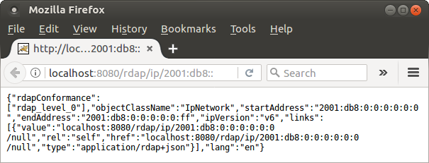

# Server Installation

The server is your typical servlet Java WAR; simply toss it into your favorite servlet container. The following is an improvised example on how you might do this in Ubuntu/Tomcat; if you favor other means or environments, knock yourself out. ([Payara](http://www.payara.fish/) and [Wildfly](http://wildfly.org/) have been tested as well as Tomcat.)

## Install Java

	sudo apt-get install openjdk-8-jre

## Install Tomcat

	# I'm not using the Ubuntu repositories because their Tomcat is rather old.
	# You will probably need to adapt this link because it keeps changing.
	# See www-us.apache.org/dist/tomcat/tomcat-8
	wget www-us.apache.org/dist/tomcat/tomcat-8/v8.5.12/bin/apache-tomcat-8.5.12.tar.gz
	tar -xzvf apache-tomcat-8.5.12.tar.gz
	CATALINA_HOME=$(pwd)/apache-tomcat-8.5.12
	JRE_HOME=/usr/lib/jvm/java-8-oracle/jre

## Install Red Dog on Tomcat

	mkdir $CATALINA_HOME/webapps/rdap
	cd $CATALINA_HOME/webapps/rdap
	# www.reddog.mx/server-download.html
	wget https://github.com/NICMx/releases/raw/master/RedDog/rdap-server-{{ site.latest-server }}.war
	jar -xvf rdap-server-{{ site.latest-server }}.war
	rm rdap-server-{{ site.latest-server }}.war

## Add your data access implementation to the classpath

	mv <path-to-your-implementation> WEB-INF/lib

For example:

	mv ~/Downloads/rdap-sample-daa-impl-{{ site.latest-sample-data-impl }}.jar WEB-INF/lib

If your classpath only contains one implementation, that's all you need. Otherwise state the hub class of your intended implementation in the `data-access.properties` file.

	echo "data-access-implementation = mx.nic.rdap.sample.SampleHub" > WEB-INF/data-access.properties

If your implementation requires configuration, now would be a good time to tweak it by adding more key-values to `data-access.properties`. This file is rdap-server's [data access configuration file](https://github.com/NICMx/rdap-data-access-api/blob/v1.1.0/src/main/java/mx/nic/rdap/db/spi/DataAccessImplementation.java#L29).

# Start Tomcat

	$CATALINA_HOME/bin/startup.sh

Your Red Dog server is now running and serving data provided by your implementation.

